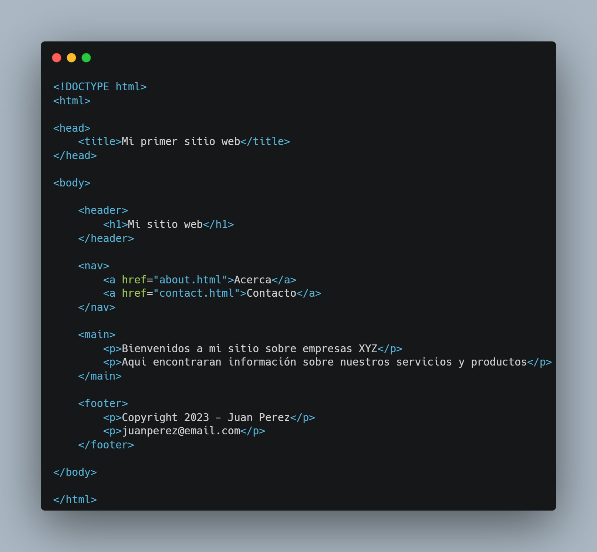
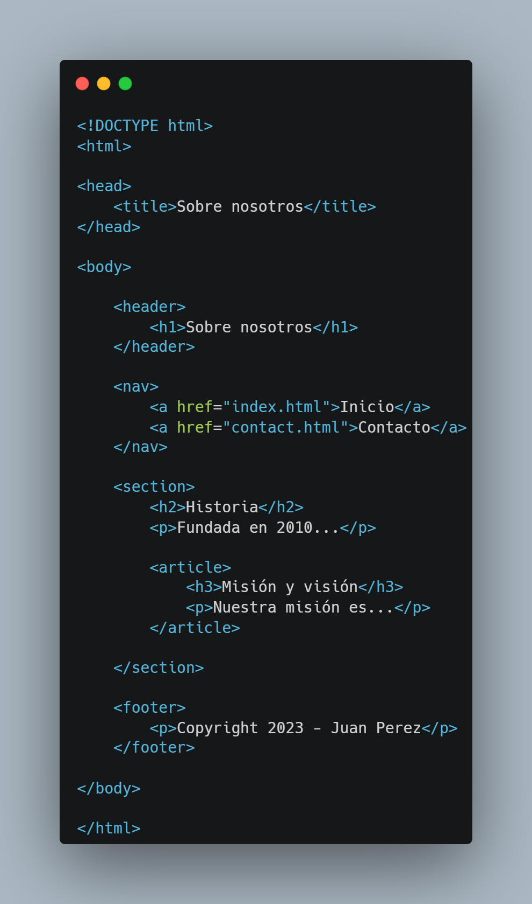
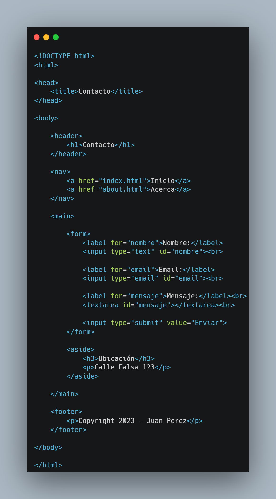

<!-- No borrar o modificar -->
[Inicio](./index.md)

## Sesión 2

# Actividad: Creando mi primer sitio web

Crea un sitio web compuesto por 3 páginas HTML utilizando la estructura y los elementos que has aprendido. Personaliza el sitio y utiliza diferentes etiquetas HTML.

Las páginas del sitio serán:

- Index o página de inicio
- Acerca
- Contacto

# index.html


# About.html


# Contact.html


## Solucion

Aqui se muestra el codigo hecho para crear las paginas

## Index.html

``` html

<!DOCTYPE html>
<html lang="en">
<head>
    <meta charset="UTF-8">
    <meta name="viewport" content="width=device-width, initial-scale=1.0">
    <title>index pagina</title>
</head>
<body>
    <header>
    <h1>Inicio de pagina web</h1>
    </header>
    
    <nav>
        <a href="acerca.html" target="_blank">acerca de:</a>
        <br>
        <a href="contacto.html" target="_blank">Contacto:</a>
    </nav>

    <main>
        <p>Bienvenidos a mi pagina web (de prueba)<br>Aqui encontraras distintas paginas para ir manteniendo el ritmo de esta practica.
    </main>

    <footer>
        <strong><p>Miguel Roldan</p></strong>
        <strong><p>Cesde</p></strong>
        <strong><p>Todos los derechos reservados</p></strong>
    </footer>
</body>
</html>

```

## About.html

``` html

<!DOCTYPE html>
<html lang="en">
<head>
    <meta charset="UTF-8">
    <meta name="viewport" content="width=device-width, initial-scale=1.0">
    <title>Acerca de</title>
</head>
<body>
    <header>
        <strong><h1>Sobre nosotros</h1></strong>
    </header>

    <nav>
        <a href="index.html" target="_blank">Pagina incial</a>
        <br>
        <a href="contacto.html" target="_blank">contacto</a>
    </nav>

    <section>
        <h2>Nuestra historia</h2>
        <p>Mi proyecto para programar es seguir aprendiendo cada dia mas <br> sobre la tecnologia y embarcarme completamente a lo que me gusta que es la informatica</p>

    <articule>
        <h2>Mision y vision</h2>
        <h3>Mision</h3>

         <ul>
            <li><p>Mi mision es lograr aprender lo basico y lo avanzado en la <br> programacion para empezar a cumplir mis metas a futuro</p>
            </li>
         </ul>

         <h3>Vision</h3>

         <ul>
            <li><p>Mi vision es empezar a programar en grandes empresas como bancarias o financieras,<br> creando sus paginas y empezando la logica tecnologica de ellos</p>
            </li>
         </ul>
    </articule>

    </section>
    
</body>

<footer>
    <strong><p>Miguel Roldan</p></strong>
    <strong><p>2021</p></strong>
    <strong><p>Todos los derechos reservados</p></strong>
</footer>
</html>

```

## Contact.hmtl
``` html

<!DOCTYPE html>
<html lang="en">
<head>
    <meta charset="UTF-8">
    <meta name="viewport" content="width=device-width, initial-scale=1.0">
    <title>Contacto</title>
</head>
<body>
    <header>
        <h1>Contactos</h1>
    </header>

    <nav>
        <a href="acerca.html" target=_blank">acerca de:</a>
        <br>
        <a href="index.html" target=_blank">Pagina inicial</a>
    </nav>

    <main>
        <form>
            <u><label for="nombre">Miguel:</label></u>
            <input type="text" id="nombre"><br>

            <u><label for="email">miguelangelroldan09@gmail.com:</label></u>
            <input type="email" id="email"><br>

            <u><label for="mensajes">mensajes</label><br></u>
            <textarea id="mensajes"></textarea><br>

            <input type="submit" value="enviar">
        </form>

        <aside>
            <h2>ubicacion</h2>
            <p>Calle machado 41 Copacabana</p>
        </aside>
    </main>

    <footer>
        <strong><p>Miguel Roldan</p></strong>
        <strong><p>Cesde</p></strong>
        <strong><p>Todos los derechos reservados</p></strong>
    </footer>
</body>
</html>

```

